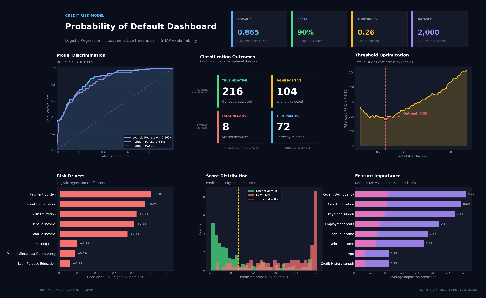

# 🏦 Credit Risk Model — Probability of Default

A fintech project that predicts borrower default probability and makes risk-based lending decisions.

> Built by a Banking & Finance student specializing in Fintech.



 Results

| Metric | Value |
|--------|-------|
| ROC-AUC | 0.865 |
| Recall | 90% (catches 9 of every 10 defaulters) |
| Optimal Threshold | 0.26 (cost-sensitive) |
| Models Compared | Logistic Regression vs Random Forest |

 What It Does

This model predicts whether a loan applicant will default, then translates that probability into a real lending decision:

| Probability of Default | Decision |
|------------------------|----------|
| Less than 5% | APPROVE |
| 5% – 15% | APPROVE with higher interest |
| 15% – 30% | MANUAL REVIEW |
| 30% or more | REJECT |

It also calculates **Expected Loss** using the Basel II formula:

EL = PD × LGD × EAD
```

where LGD = Loss Given Default (45% industry standard) and EAD = the loan amount.

---

How to Use

 1. Install dependencies (one time)

pip install -r requirements.txt

2. Train the model (one time)

python credit_risk_model.py
This trains the model on historical data, generates the dashboard, and saves the trained model to `trained_model.pkl`.

### 3. Score new applicants (any time)

python score_applicant.py

Just answer the question. The model gives you a decision in seconds.

---

 Key Featurees
Feature Engineering — uses banking-grade ratios (debt-to-income, loan-to-income, payment burden, credit utilization × debt) instead of raw numbers.

Model Comparison— trains both Logistic Regression and Random Forest, selecting Logistic Regression for explainability under regulatory constraints.

SHAP Explainability— every individual decision can be traced back to the specific features that drove it, satisfying regulatory requirements for transparent lending (GDPR, ECOA, Fair Lending Act).

---
Technical Stack

- Python 3.10+
- pandas, numpy — data manipulation
- scikit-learn — modeling
- SHAP — explainability
- matplotlib — visualization
- joblib — model persistence

---
 Files

| File | Purpose |
|------|---------|
| `credit_risk_model.py` | Trains the model and generates the dashboard |
| `score_applicant.py` | Interactive scoring of new applicants |
| `requirements.txt` | Python dependencies |
| `credit_risk_dashboard.png` | Performance visualization |

---

*Disclaimer: This model uses synthetic data for demonstration. It is not intended for actual lending decisions.*
